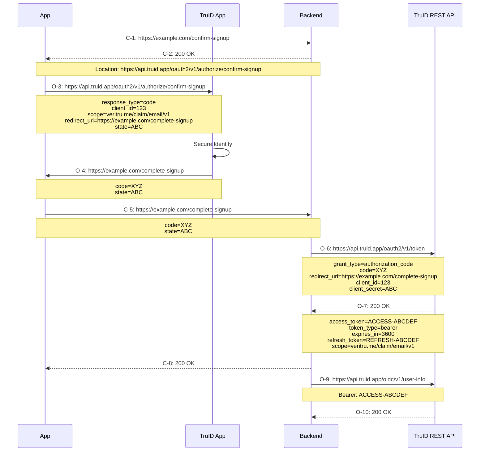

# Client App with Backend

## Overview

The goal of this integration flow is to give a service backend access to user data from TruID. The user is interacting with the service using an app.

This flow uses the OAuth2 Authorization Code Grant to allow the user to authorize the backend to access the TruID API to fetch data about the user.

_Notes:_

TruID is currently not using the [PKCE extension](https://oauth.net/2/pkce/) to the OAuth2 Authorization Code Grant. This will however be required at some point in the future.

Documentation about different TruID flows:
- TBD: Link to documentation about confirm-signup, single transaction, login, ...

Standards:
- [RFC 6749 - Authorization Code Grant](https://www.rfc-editor.org/rfc/rfc6749#section-4.1)
- [OAuth2 on oauth.net](https://oauth.net/2/)
- [Authorization Code Grant on oauth.net](https://oauth.net/2/grant-types/authorization-code/)

## Flow

This sequence diagram gives an overview of the flow.

#### Legend

&nbsp; &nbsp; *C-N* denotes service specific messages

&nbsp; &nbsp; *O-N* denotes OAuth2 standard messages

#### Steps

&nbsp; &nbsp; *C-1:* The app is initiating the flow by asking the backend for an URL to use for starting the flow towards TruID.

&nbsp; &nbsp; *C-2:* Return authorization URL

&nbsp; &nbsp; *O-3:* The app is requesting access from TruID. This request is opening the TruID App which is used for authenticating the user.

&nbsp; &nbsp; *O-4:* The TruID App is redirecting back to the app with a code that can be used to get an access token

&nbsp; &nbsp; *C-5:* The app is completing the flow by sending the code to the backend

&nbsp; &nbsp; *O-6:* The backend is using the code to get an access token from TruID

&nbsp; &nbsp; *O-7:* The TruID API is returning an access token

&nbsp; &nbsp; *C-8:* The backend is returning a response to the app, confirming that the flow is complete

&nbsp; &nbsp; *O-9:* The backend uses the access token to fetch data from the TruID API

&nbsp; &nbsp; *O-10:* The TruID API returns data about the user

## Integrarion

This section describes the steps needed to integrate a service with TruID.

### 1. Configure Service in TruID

Currently the process of configuring a service in TruID requires contacting the TruID support and ask for a service to be registered. Eventually this process will be replaced with a self service UI.

The information needed to configure the service is:
- Service Name
- Service Icon, in png or jpeg format
- Redirect URI, to redirect back to the app
- A set of claims that the service should be allowed to request

When the service is configured, a `client_id` and a `client_secret` is created. The secret must be kept secure, if it is leaked an attacker will be able to use it to access protected resources.

_Links:_

- TBD: Link to claim definitions

### 2. Create endpoint for authorization URL

Add an endpoint in the backend which has the purpose of creating an Authorization Request URL, and redirect the app to this URL. This corresponds to the steps _C-1_ and _C-2_ in the flow above. The returned Authoization Request URL will then be used in step _O-3_ in the flow above.

The Authorization Request URL follows the OAuth2 standard for an Authorization Request. The URL will point to different endpoints in the TruID API depending on which TruID Authorization Flow that should be started.

To start a TruID Confirm Signup flow, the Authorization Request URL should point to `https://api.truid.app/oauth2/v1/authorization/confim-signup`.

TBD: Link to TruID API specification for authorization URL

TBD: Link to documentation about different TruID flows

_Notes:_

The `redirect_uri` parameter is where the client will be redirected with an authorization code. This URL must match exactly what is configured in TruID.

The `scope` parameter must be a subset of the claims that were given when configuring the service in TruID.

The `state` parameter must be used to prevent cross-site request forgery, see [RFC-6749 Section 10.12](https://www.rfc-editor.org/rfc/rfc6749#section-10.12).

_Example:_

`https://api.truid.app/oauth2/v1/authorization/confirm-signup?response_type=code&client_id=abcdef&scope=veritru.me%2Fclaim%2Femail%2Fv1&redirect_uri=https%3A%2F%2Fexample.com%2Fcomplete-signup&state=123456`

_Links:_

- [RFC-6749 - Authorization Request](https://www.rfc-editor.org/rfc/rfc6749#section-4.1.1)
- [RFC-6749 - Cross-Site Request Forgery](https://www.rfc-editor.org/rfc/rfc6749#section-10.12)
- TBD: Link to TruID API specification
- TBD: Link to code example

### 3. Fetch authorization URL and rediect to TruID

Start the Authorization Flow from the app, by sending a request to the endpoint created in step 2 and fetch the Authorization Request URL. The app should open this URL, which should trigger the TruID App to be opened. This corresponds to step _O-3_ in the flow above.

_Links:_

- TBD: Link to code example

### 4. Add Deep Linking for redirect URI

Once the TruID App has authenticated the user and the user has given consent to share data with the service, the TruID App will redirect back to the app using the redirect URI. This is the URI given in the `redirect_uri` parameter in the Authorization Request created in step 2, and must match exactly the redirect URI that is configured in step 1. This corresponds to step _O-4_ in the flow above.

This URI must be a `https` URL, and the app must be associated with the domain. On Android the URL should work as an [Android App Link](https://developer.android.com/training/app-links) to open the app, and on iOS it should works as an [Universal Link](https://developer.apple.com/documentation/xcode/allowing-apps-and-websites-to-link-to-your-content) to open the app.

When the app is opened by the redirect URI deep link, it should send a request to the backend endpoint, described in step 5, to complete the authorization process. This corresponds to step _C-5_ in the flow above. It must pass on all parameters from the received redirect URI. This URI will contain a number of parameters, for example an authorization code that the backend should use to request an access token from the TruID API.

_Links:_

- [RFC-6749 - Authorization Response](https://www.rfc-editor.org/rfc/rfc6749#section-4.1.2)
- [Android - App Links](https://developer.android.com/training/app-links)
- [iOS - Universal Links](https://developer.apple.com/documentation/xcode/allowing-apps-and-websites-to-link-to-your-content)
- TBD: link to example code

### 5. Add endpoint for completing authorization

Add an endpoint for completing the authorization. This corresponds to step _C-5_ in the flow above.

The service should invoke the TruID API token endpoint to complete the authorization flow, and to exchange the code into an access token and a refresh token. This corresponds to step _O-6_ and _O-7_ in the flow above.

The returned access token can be used to request user data from the TruID API. The access token represents users consent to share data with the service. The expiry time of the access token will be quite short, and the service should not store the access token after it has completed processing of the request.

The returned refresh token should be persisted and associated with the logged in user. The refresh token can be used to request a new access token. The refresh token must be kept secure, if it is leaked an attacker will be able to use it to access user data.

_Notes:_

The backend must authenticate the request to identify the logged in user that sent the request. The `state` parameter can not be used to identify the user, since it could be faked. How the service choses to authenticate users is up to the service to decide.

The service must verify that the `state` parameter is correct and matches the logged in user, to prevent cross-site request forgery, see [RFC-6749 Section 10.12](https://www.rfc-editor.org/rfc/rfc6749#section-10.12).

If the user cancels the authorization request, or if there is any other error during the authorization flow, the redirect will contain an `error` parameter that identifies the error. The service should return a 403 response from this endpoint in that case.

_Links:_

- [RFC-6749 - Access Token Request](https://www.rfc-editor.org/rfc/rfc6749#section-4.1.3)
- [Authorization Code Request on oauth.net](https://www.oauth.com/oauth2-servers/access-tokens/authorization-code-request/)
- [RFC-6749 - Cross-Site Request Forgery](https://www.rfc-editor.org/rfc/rfc6749#section-10.12)
- TBD: link to TruID API documentation
- TBD: link to code example

### 6. Access the TruID User Info endpoint

When the service want to use user data from TruID it should use the stored refresh token to get a new access token, and then use the access token to fetch the user data from the TruID API. This corresponds to the steps _O-9_ and _O-10_ in the flow above.

The TruID API contains several endpoints that supports multiple formats to fetch user data. There is an endpoint that returns user data in a proprietary format which contains complete information about each data point. There are also other endpoints that produces data in standard formats such as for example the OIDC user-info format.

_Notes:_

Data can be fetched multiple times and at any time, not necessarily at the same time that the authorization flow is completed and the access token is first fetched.

The service is not supposed to persist any user data that is retreived from the TruID API except the refresh token. The data will be available to fetch from the TruID API for as long as the user has a connection to the service.

_Links:_

- [RFC-6749 - Refreshing an Access Token](https://www.rfc-editor.org/rfc/rfc6749#section-6)
- [RFC-6749 - Accessing Protected Resources](https://www.rfc-editor.org/rfc/rfc6749#section-7)
- [Refresh Token on oauth.net](https://oauth.net/2/grant-types/refresh-token/)
- [Refreshing Access Tokens on oauth.net](https://www.oauth.com/oauth2-servers/access-tokens/refreshing-access-tokens/)
- TBD: link to RFC for userinfo endpoint
- TBD: link to TruID API documentation for refresh
- TBD: link to TruID API documentation for user-info
- TBD: link to code example
