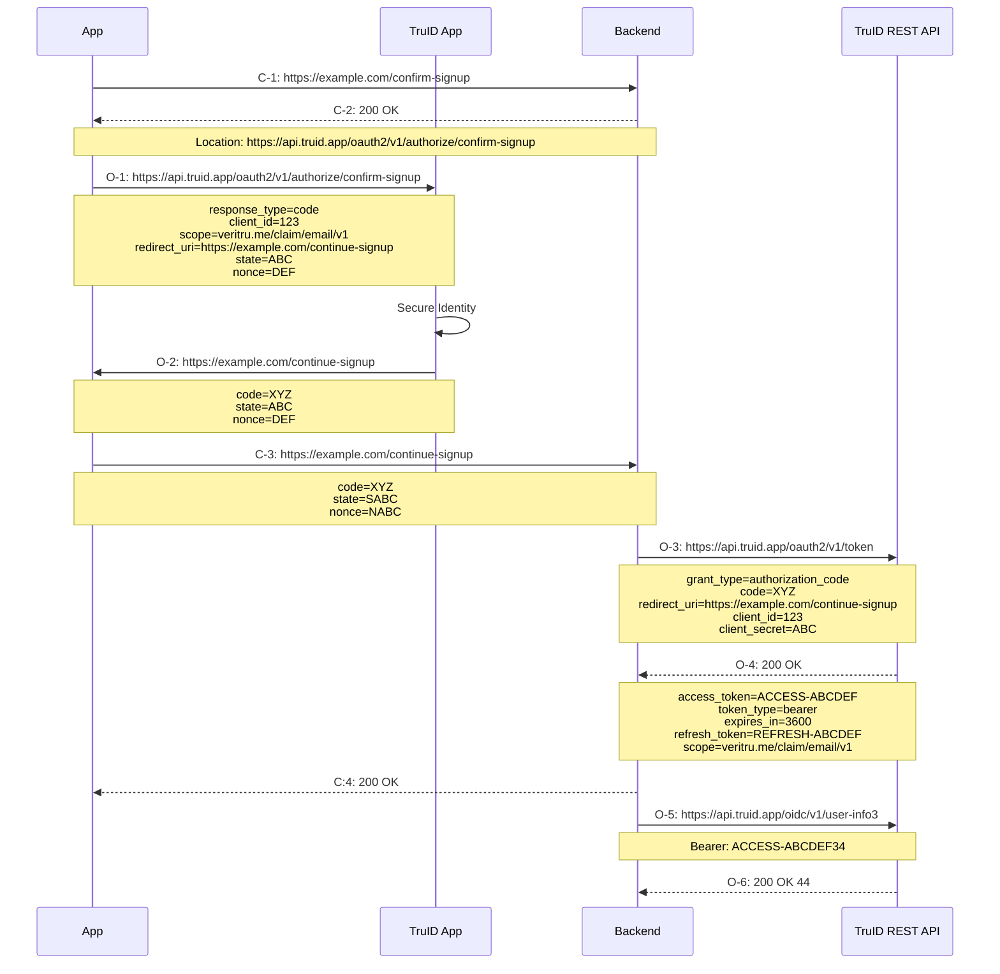

# Integrate Client App with Backend

<!--
TODO: Build script that generates .png from .puml files
TODO: Add very simple example backend and app, that demonstrates each of the steps below
TODO: Add build script that generates HTML from the markup
TODO: Include generated REST API documentation when building
TODO: add publish script that publishes to truid.app or to github.com pages
-->

TBD: Overview, description of usecase and reference to oauth2 code flow

TBD: include image app-with-backend.puml

TBD: description of each of the steps in the diagram. - Link to RFC/oauth.net

TBD: Short overview of steps and links to each step. Sort of a table of contents. Only needed if the descriptions become long.

1. Create endpoint for authorization URL
- Link to RFC/oauth.net
- Link to TruID API documentation
- Link to example code in this repo

2. Configure Service in TruID

3. Fetch authorization URL and rediect to TruID

4. Add Deep Linking for redirect URI

5. Add endpoint for completing authorization

6. Access the TruID User Info endpoint
